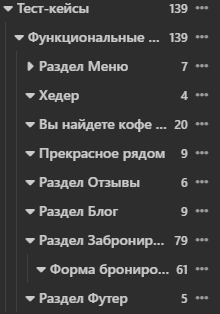
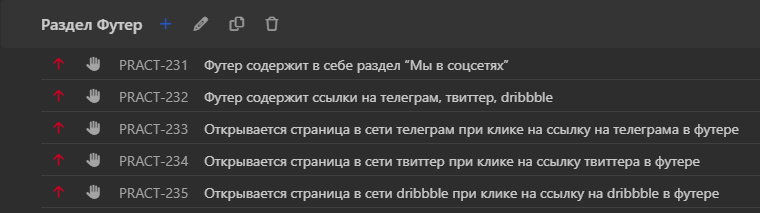

# Практикум. Составление тест-кейсов. Позитивное и негативное тестирование

Задание на практикуме: составление тест-кейсов по проекту.

- Стенд: https://test-stand.gb.ru/seminar_stands/coffee/index.html

- Документация: https://docs.google.com/document/d/1PLkucgibKf-

- Выгрузка тест-кейсов из TMS
  Qase: https://drive.google.com/file/d/1tq29HX9XI0Whm4Kz5St7xBW_LKu8om-R/view?usp=drive_link

- На основе техник тест-дизайна и чек-листа, составленных
  ранее: https://docs.google.com/spreadsheets/d/1-BgNKBY2TWXUec0Xp0AubJGW55efGpXGoz6TY5nwKcg/edit?usp=drive_link

# Составленный тест-кейсы

